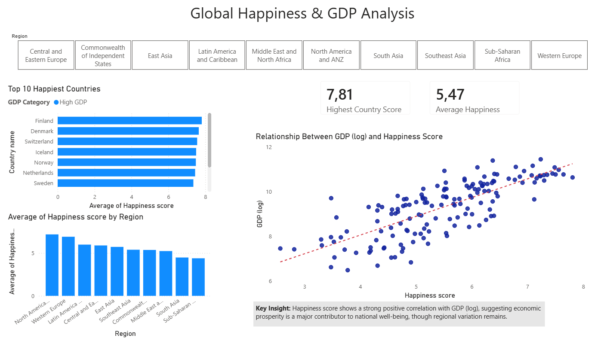
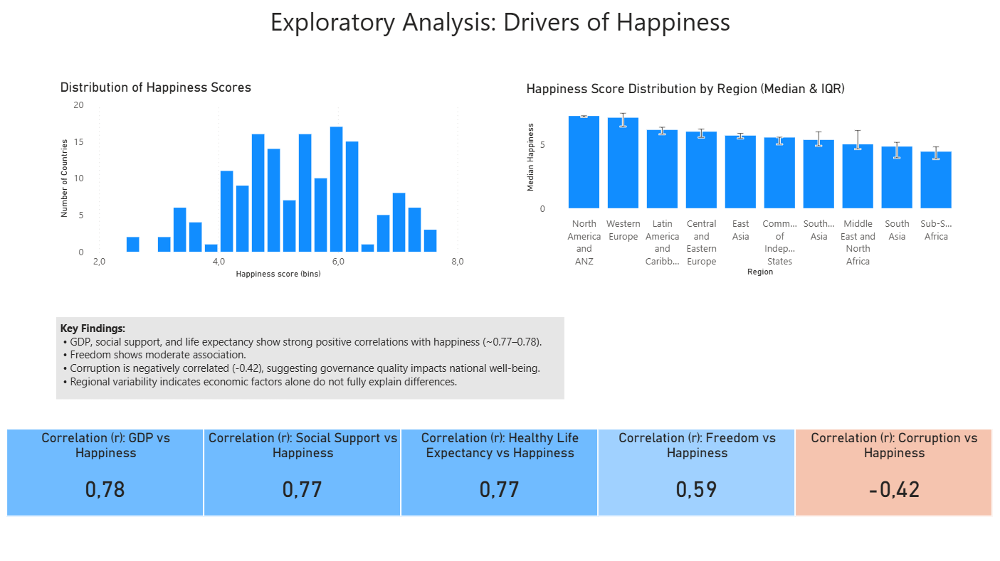

# Global Happiness Analysis – Python & Power BI

## Project Overview

This project explores global happiness scores and their relationship to key socioeconomic indicators using exploratory data analysis (EDA) in Python and interactive reporting in Power BI.

The objective was to:
- Understand the distribution of happiness scores
- Identify key drivers of national happiness
- Examine regional differences
- Build a reproducible workflow from raw dataset to dashboard

---

## Dataset

The analysis uses the World Happiness dataset for 2020, which contains country-level measures of:

- Happiness score  
- Logged GDP per capita  
- Social support  
- Healthy life expectancy  
- Freedom to make life choices  
- Perceptions of corruption  
- Regional classification  

---

## Project Workflow

Raw dataset → Python cleaning & EDA → Processed dataset export → Power BI dashboard

1. Loaded raw dataset into Python
2. Cleaned and renamed variables for clarity and modelling consistency
3. Performed exploratory data analysis (distribution, correlation, segmentation)
4. Exported processed dataset for reporting
5. Built interactive Power BI dashboard using cleaned dataset

---

## Key Findings

- Happiness scores are concentrated between approximately 4.5 and 6.5 globally.
- Logged GDP per capita, social support, and healthy life expectancy show strong positive correlations with happiness (r ≈ 0.77–0.78).
- Freedom shows a moderate positive relationship (r ≈ 0.59).
- Perceptions of corruption show a moderate negative correlation (r ≈ -0.42).
- Regional median and interquartile range (IQR) analysis highlights meaningful variability beyond purely economic factors.

---

## Power BI Dashboard

The Power BI dashboard includes:

- Distribution analysis (histogram of happiness scores)
- Correlation summary panel (Pearson r values)
- Regional median and IQR comparison
- Interactive filtering by region

### Page 1 – Overview

### Page 2 – Drivers & Distribution

---

## Skills Demonstrated

- Data cleaning and transformation (pandas)
- Exploratory data analysis (EDA)
- Correlation analysis and statistical reasoning
- Regional segmentation analysis
- Data modelling for reporting
- Power BI dashboard design
- Reproducible project structuring

---

## Repository Structure

data/
raw/ – Original dataset
processed/ – Cleaned dataset used for reporting
notebooks/ – Python exploratory analysis
powerbi/ – Power BI dashboard file
requirements.txt
README.md

---

## How to Run

1. Install dependencies:

pip install -r requirements.txt

2. Run notebook:

notebooks/happiness_analysis.ipynb

3. Open the Power BI dashboard file in the `powerbi/` folder.

---

## Limitations

- Correlation does not imply causation.
- Analysis is cross-sectional and does not account for temporal effects.
- Some variables may exhibit multicollinearity (e.g., GDP and life expectancy).

---

